# Code_Refractor

## Summary
When reviewing the original framework provided, I immediately found a number of redundancies and multiple layers of code that were either repetitive or simply unnecessary.

Hence, in order to make my html and css file more readable and accessible, I renamed most of the div tags and consolidated styles that were similar and grouped them together. This way, each tag is now with purpose and provides meaning.

## Links
1. [Github Repository](https://github.com/jkaganovsky/Code_Refractor)
1. [Deployed website](https://jkaganovsky.github.io/Code_Refractor/)

## CSS and HTML Screenshot Comparisons
1. Title
    * Original HTML

    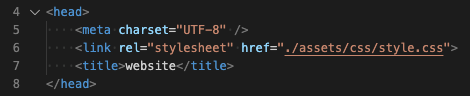

    * Edited HTML

    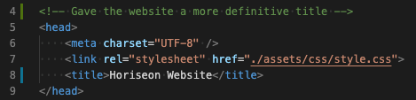

1. Header
    * Original CSS

    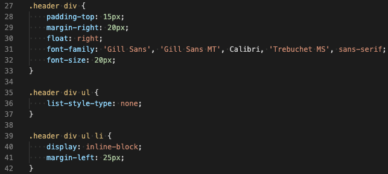

    * Edited CSS

    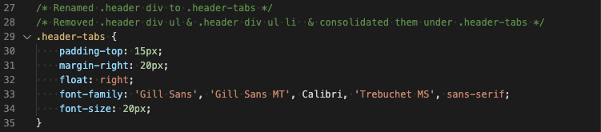

    * Original HTML

    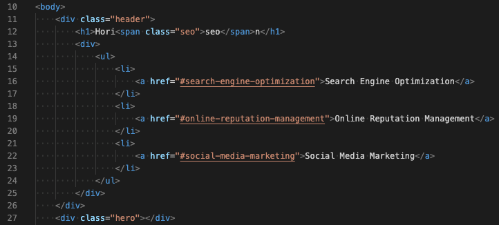

    * Edited HTML

    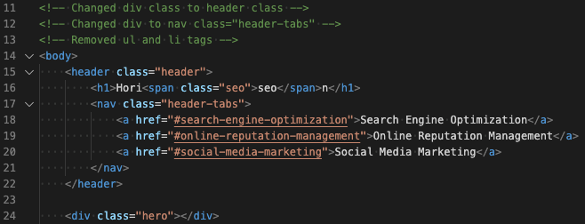

1. Content
    * Original CSS

    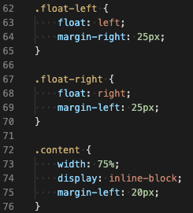
    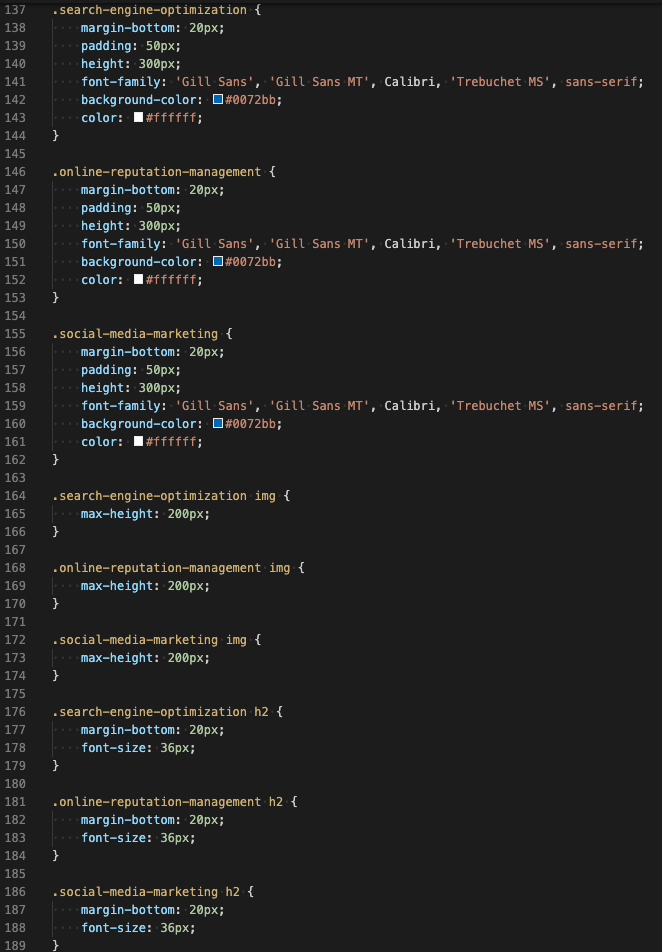

    * Edited CSS

    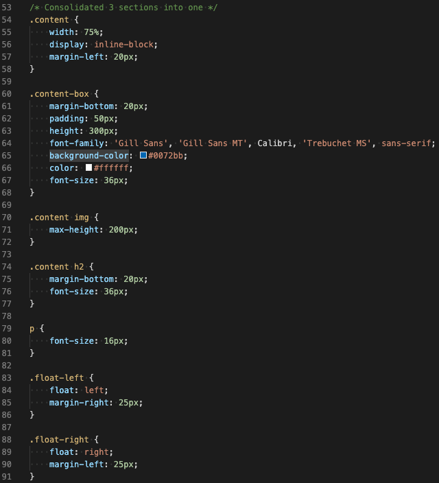

    * Original HTML

    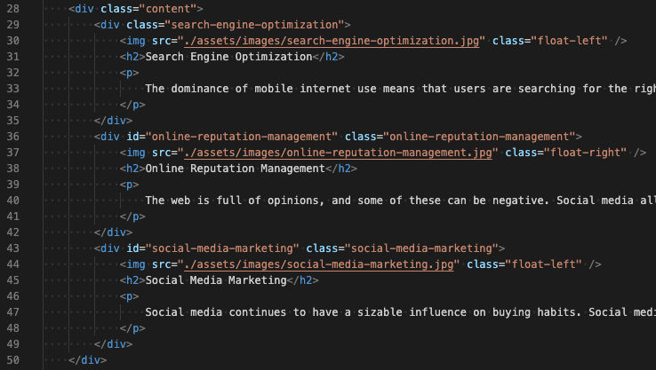

    * Edited HTML

    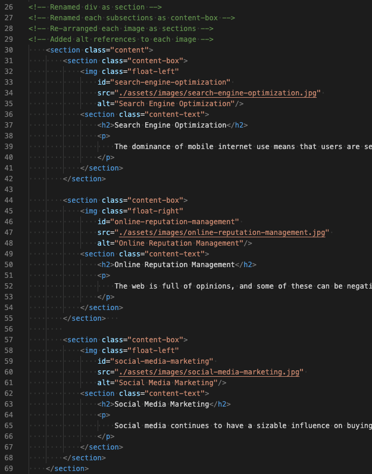

1. Benefits
    * Original CSS

    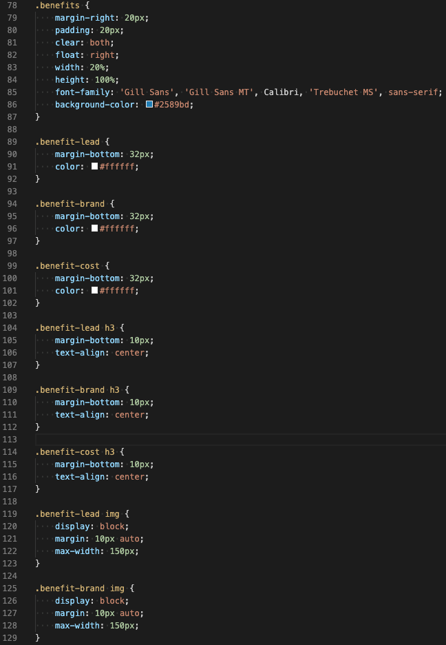
    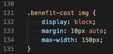

    * Edited CSS

    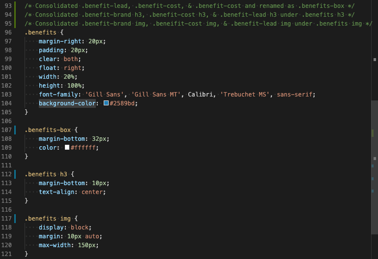

    * Original HTML

    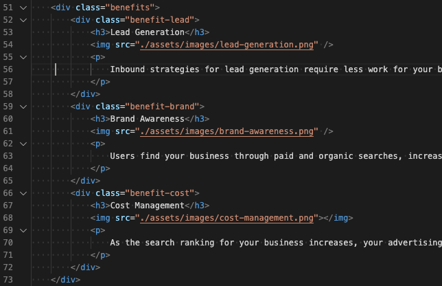

    * Edited HTML

    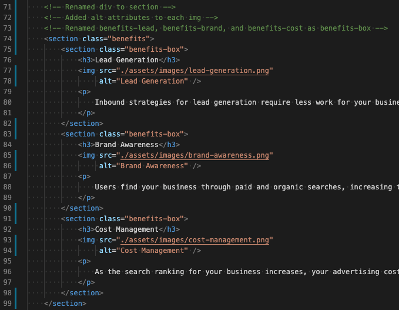

1. Footer
    * Original CSS

    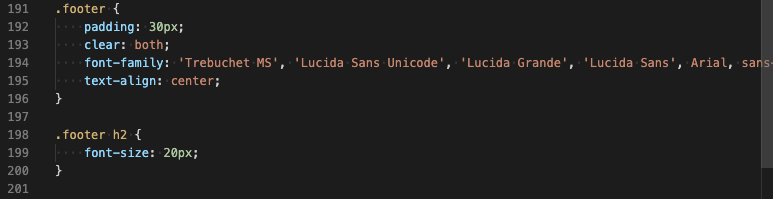

    * Edited CSS

    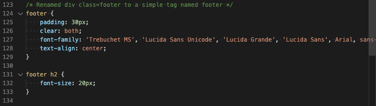

## Credits
Tags I referred to in order to replace most div in the html file:
https://www.w3schools.com/tags/default.asp

## License
MIT License

Copyright (c) [2020] [Jailanie Kaganovsky]

Permission is hereby granted, free of charge, to any person obtaining a copy
of this software and associated documentation files (the "Software"), to deal
in the Software without restriction, including without limitation the rights
to use, copy, modify, merge, publish, distribute, sublicense, and/or sell
copies of the Software, and to permit persons to whom the Software is
furnished to do so, subject to the following conditions:

The above copyright notice and this permission notice shall be included in all
copies or substantial portions of the Software.

THE SOFTWARE IS PROVIDED "AS IS", WITHOUT WARRANTY OF ANY KIND, EXPRESS OR
IMPLIED, INCLUDING BUT NOT LIMITED TO THE WARRANTIES OF MERCHANTABILITY,
FITNESS FOR A PARTICULAR PURPOSE AND NONINFRINGEMENT. IN NO EVENT SHALL THE
AUTHORS OR COPYRIGHT HOLDERS BE LIABLE FOR ANY CLAIM, DAMAGES OR OTHER
LIABILITY, WHETHER IN AN ACTION OF CONTRACT, TORT OR OTHERWISE, ARISING FROM,
OUT OF OR IN CONNECTION WITH THE SOFTWARE OR THE USE OR OTHER DEALINGS IN THE
SOFTWARE.
